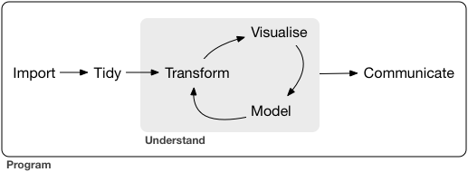
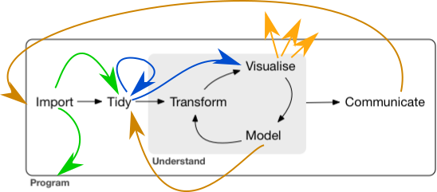
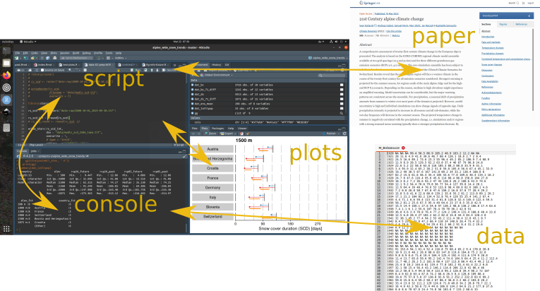
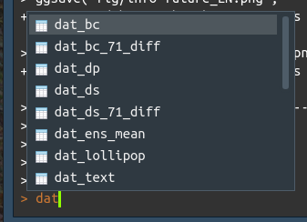
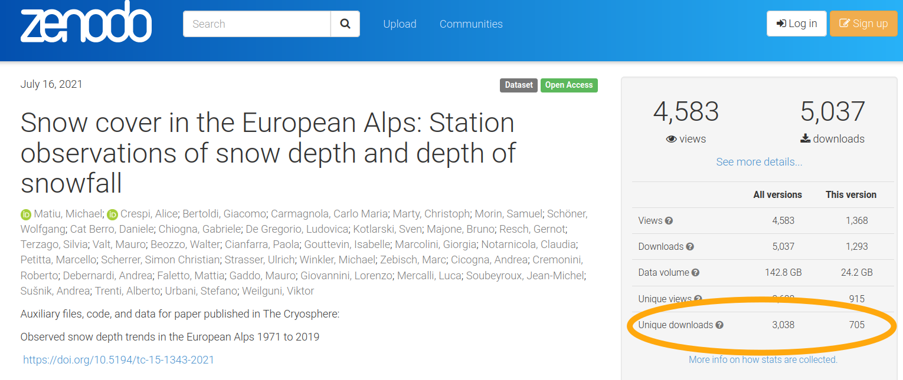

```{r setup, include=FALSE}
options(htmltools.dir.version = FALSE)
xaringanExtra::use_panelset()
xaringanExtra::use_freezeframe()
xaringanExtra::use_webcam()
```


### Foreword

.pull-left[
- Slides available at https://mitmat.github.io/slides/

- *Data* = any information in general, focus on digital

- *Code* = anything you do to data, regardless of means (R, python, Excel, ...)


]

--

.pull-right[

- Knowledge of directory structure (see also this [article](https://www.theverge.com/22684730/students-file-folder-directory-structure-education-gen-z) at The Verge)

.center[<a title="Przemub, Public domain, via Wikimedia Commons" href="https://commons.wikimedia.org/wiki/File:Ms-dosdir.png"></a>]

Warning: slightly biased towards <a href="https://commons.wikimedia.org/wiki/File:R_logo.svg#/media/File:R_logo.svg"></a>

]


<!-- ### Outline -->

<!-- Before you start   -->
<!-- Data   -->
<!-- Code   -->
<!-- Share -->


---


## 0. Before you start your project

If you don't have it: Create folder to store all past and future projects
```{r eval=F}
# wherever you like: Documents, Desktop, home/
/projects/
``` 


--


Create sub-folder for current project
```{r eval=F}
# try not to have a long name
/projects/time-series-analysis-of-winter-precipitation-europe
# better
/projects/winter-prec
``` 

--

Everything in here! **--> Working directory <-- **   
(Use IDE capabilities: RStudio, Spyder, PyCharm)

---


### Example structure of working directory

.pull-left[
Basic

```{r eval=F}
data/
data-raw/
R/
fig/
winter-prec.Rproj
```
]

--

.pull-right[
Grow as needed

```{r eval=F}
data/
data-aux/
data-raw/
doc/
fig/
paper/
R/
table/
winter-prec.Rproj
```
]

---


### Why a working directory?

- Organization

- Everything in one place (code, data, output)

--

- Relative file paths allow easy sharing/copying:

```{r eval=F}
# only works on your computer
tbl <- read_csv("C:/Users/michael/Desktop/research/winter.csv")

# works for everybody
tbl <- read_csv("data-raw/winter.csv")
```

- Exception: data hosted on servers (but then paths work for everyone within the institution)


---


### Why a working directory?


- Better for output, too:

```{r eval=F}
# only works on your computer
ggsave("C:/Users/michael/Documents/papers/winter-precipitation/fig01.pdf")

# works for everybody
ggsave("fig/paper/fig01.pdf")
```


---

## 1. Data

What to do with the data you collected, received, downloaded, ... ?

> Store it some place and **NEVER, EVER, EVER, EVER modify it**

--

--> Your first step towards *reproducibility*

--


.pull-left[
**future you**
  - write up methods/documentation
  - have to re-do analysis
]


--


.pull-right[
**others**
  - re-do your analysis
  - do the same with their data
]


---

background-image: url("https://memegenerator.net/img/instances/44834303.jpg")
background-position: center
background-size: contain

---

### Keep track of what you did

.panelset[

.panel[.panel-name[Files]

**manually: ad-hoc versioning with documentation**

```{r eval=F}
/data/samples_meta_documentation.docx # documentation
/data/samples_meta_v1.0.xlsx # different versions of your data
/data/samples_meta_v1.1.xlsx
/data/samples_meta_v2.0.xlsx
```

]


.panel[.panel-name[Documentation]

**Content of documentation**

v1.0
- split column coordinates in lat and long
- converted lat/long from dms to decimal

v1.1
- use English for country names instead of local language

v2.0
- updated with 2022 campaign

]


.panel[.panel-name[Alternative]

**use R/python/... for data wrangling**

- scripts = documentation
- minimal/no effort to redo everything

Future you and others will thank you!

]


]


---

### Data formats


.pull-left[

**Avoid**

- mixing data with formatting (Excel)
- mixing data with summaries (Excel)
- lossy compression (`.jpeg`)
- proprietary formats (needs specific software XYZ)

]

.pull-right[

**Recommended**

- text based storage (`.csv`, `.txt`)
- keep summaries separate
- lossless compression (`.png`, `.tif`)
- open data formats

]


---


## 2. Code

### Data science workflow

.pull-left[


.center[]

.tiny[Source: R for Data Science, [R4DS](https://r4ds.had.co.nz/)]


... in theory.

]


--


.pull-right[

But usually a bit more messy ...

.center[]


]


---


### The problem: Interactive process


.center[]


---


### Solution: Alternate between...


.pull-left[

**Phase 1: creative**

*interactive* - *volatile* - *changing*

- explore
- visualize
- make errors
- check
- correct


]


.pull-right[

**Phase 2: settle**

*create a linear structure*

- separate what is good and needed vs. rest
- clean
- organize


]


**In Phase 2: Avoid interactive usage of IDE.** Move as much as possible to code/script
- reading/loading data: not import dataset, but `read_*` or `load()`
- data processing: renaming columns, replacing values
- saving plots: not with buttons, but with `pdf()` & `dev.off()` or `ggsave()`

---

### The end product: linear stand-alone script

```{r eval=F}
# [optional description] Example of a soft (not strict) guideline

# load libraries
library(tidyverse)

# input (read in data, load previously saved data)
tbl <- read_csv("data-raw/time-series.csv")
meta <- readRDS("data/meta.rds")

# process, wrangle, model, ...
...

# output (figures, other data)
ggsave("fig/fig01.png")
saveRDS(tbl_summary, "data/time-series-summary.rds")

```


---


### Save source, not workspace

- never store the workspace (`.Rdata`)
- RStudio: uncheck "Restore .Rdata into workspace at startup" in `Tools > Global Options`


- clean workspace (remove all objects)
- restart session (also remove libraries)


- use `save()` & `load()` or `saveRDS()` & `readRDS()` to split up data processing and too long scripts, or to create logical blocks of analysis in multiple files

More at [What they forgot to teach you about R](https://rstats.wtf/save-source.html)


--

### Why?

- separate independent units of analysis
- easy to re-run everything


---


### Naming files and folders

.panelset[

.panel[.panel-name[Overview]

- machine readable
  - no spaces (use `-` and `_`)
  - no punctuation
  - not case-sensitive (`fig01.png` and `Fig01.png` is the same)
  - no accents
- human readable
  - info on content
- embrace default ordering
  - ISO standard for dates
  - put something numeric first to create logical order
  - left-pad with zeros

.tiny[(borrowed from https://speakerdeck.com/jennybc/how-to-name-files)]

]


.panel[.panel-name[Files 1]

.pull-left[


```{r eval=FALSE}
R
|-- data-prep
|   |-- modis-02-tif-coarse-res.R
|   |-- modis-03-dt-snow-nosnow-clouds.R
|   |-- modis-04-dt-snc.R
|   |-- rcm-00-gridspec.R
|   |-- rcm-01-cdo.R
|   `-- rcm-02-snow-max-threshold.R
|-- ds
|   |-- compare-bc-ds.R
|   |-- rgi-make-grid-frac-cover.R
|   |-- rofental-01-comp-maps.R
|   |-- rofental-02-comp-elev-month.R
|   |-- rofental-03-region-avg.R
|   |-- rofental-04-mask-for-flo.R
...
```

]

.pull-right[

```{r eval=FALSE}
...
|   |-- rofental-05-comp-maps-ensmean.R
|   `-- rofental-06-elev-only.R
|-- functions
|   |-- longest_subseq.cpp
|   |-- longest_subseq.R
|   `-- MBC_helpers.R
|-- paper-01-initial
|   |-- fig-01-study-area.R
|   |-- fig-02-downscaling-method.R
|   |-- fig-03-bc-alps-month.R
|   |-- snow-plausible.R
|   |-- table-01-models-used.R
|   |-- zenodo-01-bc.R
|   `-- zenodo-02-ds.R
`-- temp.R

```


]

]


.panel[.panel-name[Files 2]

My first project:


```{r eval=FALSE}
temp-variability
|-- 1.R
|-- 2b.R
|-- 2.R
|-- d.R
|-- data.Rdata
|-- data2.Rdata
|-- fig10.pdf
|-- fig1.pdf
|-- fig2.pdf
|-- fun.R
|-- plot.pdf
|-- rq.R
|-- rqs.R
`-- temp-variability.Rproj
```


]

.panel[.panel-name[Dates]

.pull-left[
.center[<a title="xkcd: (ISO 8601) Dates" href="https://xkcd.com/1179"></a>]
]


.pull-right[
<blockquote class="twitter-tweet"><p lang="en" dir="ltr">Comprehensive map of all countries in the world that use the MMDDYYYY format <a href="http://t.co/jaOQp0oZyN">pic.twitter.com/jaOQp0oZyN</a></p>&mdash; Michael Donohoe (@donohoe) <a href="https://twitter.com/donohoe/status/597876118688026624?ref_src=twsrc%5Etfw">May 11, 2015</a></blockquote> <script async src="https://platform.twitter.com/widgets.js" charset="utf-8"></script> 
]

]


]


---


### Naming objects in scripts


.panelset[


.panel[.panel-name[Short vs. long]

.pull-left[
```{r eval=F}
# easier to type
df1
df2
df2b

for(i in 1960:2020){
  for(j in countries){
    ...
  }
}

```
]

.pull-right[

```{r eval=F}
# easier to guess content
coordinates
time_series
time_series_summary

for(year in 1960:2020){
  for(country in countries){
    ...
  }
}

```


]

]


.panel[.panel-name[Use auto-complete]

Keys: `TAB` or `Shift+Space`



]


.panel[.panel-name[Redundancy]

Prefix with type (controversial)
.footnotesize[
.pull-left[
```{r eval=F}
tbl_meta # table
tbl_data
sf_aux # spatial
sf_prec

# also in iterations
for(i_year in unique(tbl$year)){
  for(i_month in unique(tbl$month)){
    dplyr::filter(tbl,
                  year == i_year & 
                    month == i_month)
    ...
  }
}

```
]
.pull-right[
```{r eval=F}
meta
data
aux
prec

# avoids
for(yr in unique(tbl$year)){
  for(mo in unique(tbl$month)){
    dplyr::filter(tbl,
                  year == yr & 
                    month == mo)
    ...
  }
}

```
]

]


]


 
]


---

### Coding style

notanecessityandyoucandowithout, but code is easier read with

- personal choice
- opinionated


Try to be consistent, as far as possible.

- Tidyverse https://style.tidyverse.org/index.html
- Google https://google.github.io/styleguide/
- PEP https://peps.python.org/pep-0008/
- ...


---

### Commenting (why, not what)


.pull-left[

Not useful...

```{r eval=FALSE}
# divide x by 86400
x <- x/86400

# values above 5000 made NA
y[y > 5000] <- NA

```


]

.pull-right[

Better...

```{r eval=FALSE}
# convert per sec to per day
x <- x/86400

# recording errors removed
y[y > 5000] <- NA

```


]


--


<br>

When commenting, think about what


- **future you** might forget
- **others** would not understand


---

### Commenting (why, not what)

Obviously redundant.

```{r eval=F}
# extract numeric columns
cols_numeric <- sapply(tbl, is.numeric)
# calculate correlations
cor(tbl[, cols_numeric])
```

--

Keep track of what you did.

```{r eval=F}
# check for collinear variables
cols_numeric <- sapply(tbl, is.numeric)
cor(tbl[, cols_numeric])
# -> none found
```


---

## 3. Share


Think about others:

- What would they need to run your code?
- What do they need to understand what you did?

Think about you:
- What did you like about code/data you received or downloaded? 


---

### Do not be afraid to share your code!

.right[What's the worst that can happen?]

--

It's *ignored*.

--

.right[What's more likely?]

--

- helps others, especially early-career scientist or students
- helps you
  - increases confidence
  - others might discover errors
  - more comparisons


---

### Why share data openly?


Legal obligation -> not motivating

Funded by public money -> should be publicly available

--

<br>
So you hesitate, because you...

- feel it's your treasure
- want credit for it (because you deserve credit!)
- want to exploit it further


---
layout: true

### But!

Consider this:

- do you have the time/resources to do everything?
- others might think of truly novel/imaginative things to do with your data
- you still remain the authority


---

--

.center[]

---


> If you want to go fast, go alone.  
> If you want to go far, go together.

More success stories from sharing and collaborating.


--

<br>
Inspiring: [uncopyright](https://zenhabits.net/uncopyright/) from [zenhabits](https://zenhabits.net/)


---
layout: false

### What to consider before sharing?


Questions to yourself:
- do others know how to use it?
- do others understand the limitations?
- can there be misuse? (-> sensitive or personal information)
- are you ok with losing control?


--


### DIY

Put everything on [Zenodo](https://zenodo.org/). But DIY can go wrong...


---

.center[

]


---

### Links

R course with focus on project organization, data cleaning, ... but NOT statistical inference/modelling  
https://stat545.com/

R 4 data science  
https://r4ds.had.co.nz/

What they forgot to teach you about R  
https://rstats.wtf/


Data management recommendations from GFZ
https://bib.telegrafenberg.de/dataservices/support/data-management-recommendations

How to name things  
https://speakerdeck.com/jennybc/how-to-name-files

---


### Contact

Michael Matiu  

`r fontawesome::fa("envelope")` mmatiu.eurac@gmail.com

`r fontawesome::fa("github")` https://github.com/mitmat/

  https://clirsnow.netlify.app/

(slides) https://mitmat.github.io/slides/
