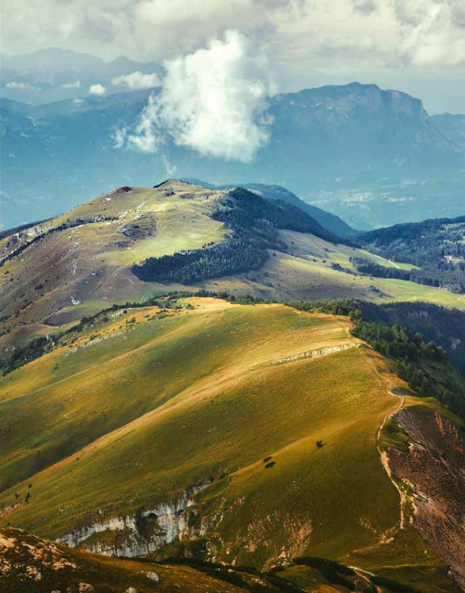
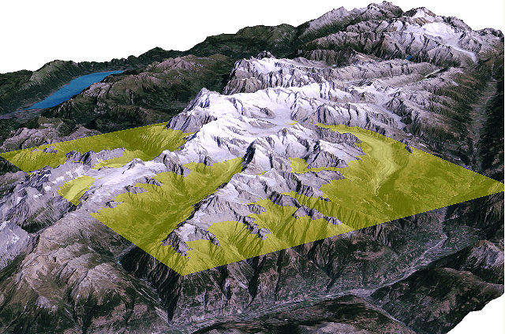
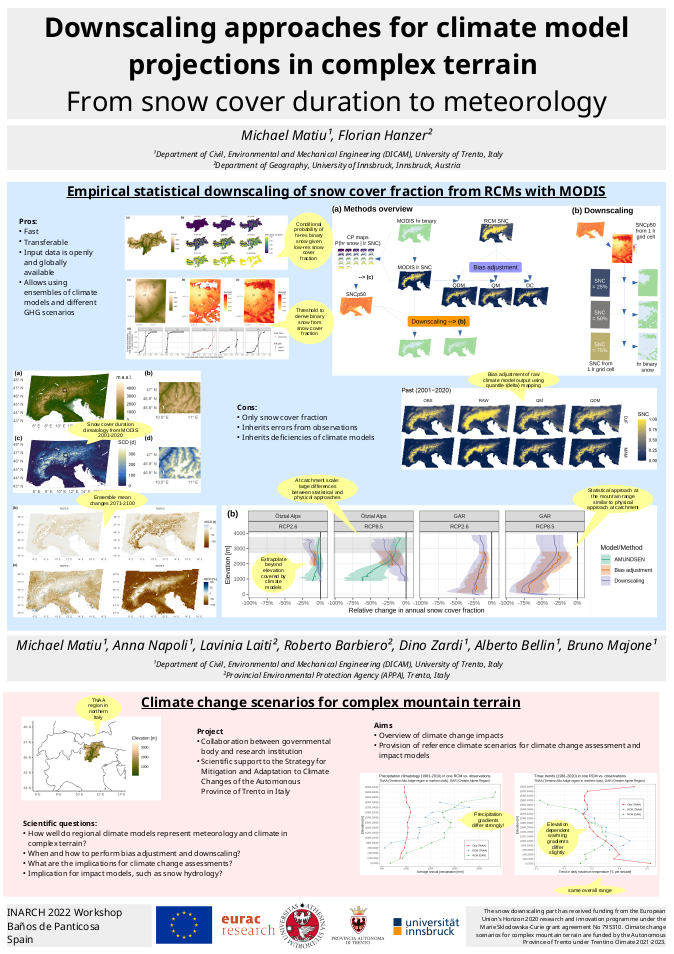

```{r setup, include=FALSE}
options(htmltools.dir.version = FALSE)
xaringanExtra::use_panelset()
xaringanExtra::use_freezeframe()
# xaringanExtra::use_webcam()
```


## Setting the scene

.pull-left[

Climate model projections


]


.pull-right[

Complex mountainous terrain



]


.footnote[Online version of these slides and the poster: https://mitmat.github.io/slides/]


---


## The problem


.center[]

.footnote[Image by: [Stephan Gruber, Carleton University](https://carleton.ca/geography/people/gruberstephan/)]


---


## No solution, but...


.pull-left[

- Empirical statistical downscaling of snow cover fraction/duration, directly from RCMs
- Scale issues
- Discuss: Downscaling of meteorology in complex terrain, elevational gradients

]


.pull-right[

.center[<a title="Download poster as PDF" href="pdf/inarch_matiu_poster.pdf"></a>]

]


.footnote[Click on poster to download it as PDF]


