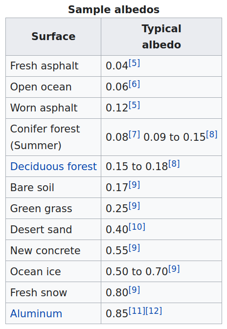

```{r setup, include=FALSE}
options(htmltools.dir.version = FALSE)
xaringanExtra::use_panelset()
xaringanExtra::use_freezeframe()
# xaringanExtra::use_webcam()
```


## Outline

1. Snow: what is it and why is it important?
2. How is snow measured
3. Snow climatology in the European Alps
4. Past and future trends of snow cover 


---

class: center, middle, inverse

# What is snow?


---
background-image: url("fig/snowfall2.jpg")
background-size: cover


.footnote[Photo <a href="https://pixabay.com/users/cocoparisienne-127419/?utm_source=link-attribution&amp;utm_medium=referral&amp;utm_campaign=image&amp;utm_content=1861704">Anja</a> from <a href="https://pixabay.com//?utm_source=link-attribution&amp;utm_medium=referral&amp;utm_campaign=image&amp;utm_content=1861704">Pixabay</a>]


---

background-image: url("fig/snow-shoveling.jpg")
background-size: cover


.footnote[Image by <a href="https://pixabay.com/users/alehandra13-1817807/?utm_source=link-attribution&amp;utm_medium=referral&amp;utm_campaign=image&amp;utm_content=3146420">Alehandra13</a> from <a href="https://pixabay.com//?utm_source=link-attribution&amp;utm_medium=referral&amp;utm_campaign=image&amp;utm_content=3146420">Pixabay</a>]


---

background-image: url("fig/snow-fun.jpg")
background-size: cover


.footnote[Image by <a href="https://pixabay.com/users/cdporter-4278988/?utm_source=link-attribution&amp;utm_medium=referral&amp;utm_campaign=image&amp;utm_content=1984387">Charles Porter</a> from <a href="https://pixabay.com//?utm_source=link-attribution&amp;utm_medium=referral&amp;utm_campaign=image&amp;utm_content=1984387">Pixabay</a>]


---

background-image: url("fig/snow-avalanche.jpg")
background-size: cover


.footnote[<a href="https://www.rainews.it/tgr/tagesschau/articoli/2019/11/tag-Martell-Lahn-Lawine-Suedtirol-Unwetter-Christian-Gurschler-de137fd1-b796-4070-a8a4-058c80353f43.html">Avalanche 2019 in Martell/Martello, Alto Adige</a>]


---


background-image: url("fig/snow-grains.png")
background-size: contain


.footnote[https://cryosphericsciences.org/publications/snow-classification/]


---


class: center, middle, inverse

# Why is snow important?


---


# Albedo


.pull-left[




]


.pull-right[


.footnote[Source: [here](https://www.essearth.com/why-albedo-is-important-for-our-melting-ice-caps/) and [here](https://en.wikipedia.org/wiki/Albedo)]

]


---

https://www.eldoradoweather.com/climate/GlobalMaps/Snow%20Cover/snowcover.php


---


