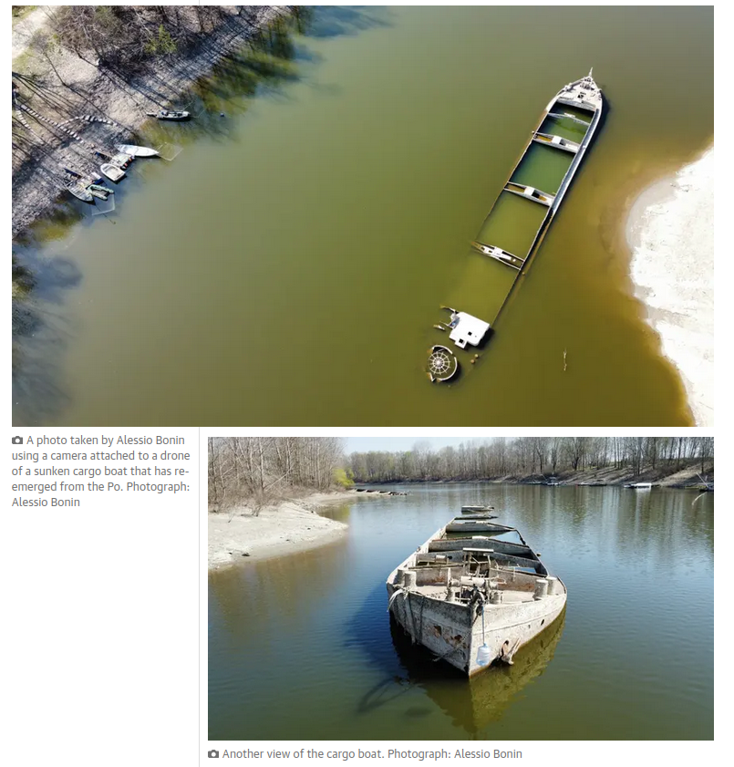

```{r setup, include=FALSE}
options(htmltools.dir.version = FALSE)
# xaringanExtra::use_panelset()
# xaringanExtra::use_freezeframe()
# xaringanExtra::use_webcam()
```

## Outline

1. Snow: what is it and why is it important?
2. How is snow measured
3. Snow climatology in the European Alps
4. Past and future trends of snow cover 


---

class: center, middle, inverse

# What is snow?


---
background-image: url("fig/snowfall2.jpg")
background-size: cover


.footnote[Photo <a href="https://pixabay.com/users/cocoparisienne-127419/?utm_source=link-attribution&amp;utm_medium=referral&amp;utm_campaign=image&amp;utm_content=1861704">Anja</a> from <a href="https://pixabay.com//?utm_source=link-attribution&amp;utm_medium=referral&amp;utm_campaign=image&amp;utm_content=1861704">Pixabay</a>]


---

background-image: url("fig/snow-shoveling.jpg")
background-size: cover


.footnote[Image by <a href="https://pixabay.com/users/alehandra13-1817807/?utm_source=link-attribution&amp;utm_medium=referral&amp;utm_campaign=image&amp;utm_content=3146420">Alehandra13</a> from <a href="https://pixabay.com//?utm_source=link-attribution&amp;utm_medium=referral&amp;utm_campaign=image&amp;utm_content=3146420">Pixabay</a>]


---

background-image: url("fig/snow-fun.jpg")
background-size: cover


.footnote[Image by <a href="https://pixabay.com/users/cdporter-4278988/?utm_source=link-attribution&amp;utm_medium=referral&amp;utm_campaign=image&amp;utm_content=1984387">Charles Porter</a> from <a href="https://pixabay.com//?utm_source=link-attribution&amp;utm_medium=referral&amp;utm_campaign=image&amp;utm_content=1984387">Pixabay</a>]


---

background-image: url("fig/snow-avalanche.jpg")
background-size: cover


.footnote[<a href="https://www.rainews.it/tgr/tagesschau/articoli/2019/11/tag-Martell-Lahn-Lawine-Suedtirol-Unwetter-Christian-Gurschler-de137fd1-b796-4070-a8a4-058c80353f43.html">Avalanche 2019 in Martell/Martello, Alto Adige</a>]


---


background-image: url("fig/snow-grains.png")
background-size: contain


.footnote[https://cryosphericsciences.org/publications/snow-classification/]


---

background-image: url("fig/snow-layer-wind.jpg")
background-size: cover

.footnote[Image by <a href="https://pixabay.com/users/natalia_kollegova-5226803/?utm_source=link-attribution&amp;utm_medium=referral&amp;utm_campaign=image&amp;utm_content=3173001">Наталья Коллегова</a> from <a href="https://pixabay.com//?utm_source=link-attribution&amp;utm_medium=referral&amp;utm_campaign=image&amp;utm_content=3173001">Pixabay</a>]

---


class: center, middle, inverse

# Why is snow important?


---


# Albedo


.pull-left[


]


.pull-right[


.footnote[Source: [here](https://www.essearth.com/why-albedo-is-important-for-our-melting-ice-caps/) and [here](https://en.wikipedia.org/wiki/Albedo)]

]


---

class: middle

.pull-left[]

.pull-right[]

.footnote[Source: [Global Snow Lab](http://climate.rutgers.edu/snowcover/index.php)]


---

class: middle

.pull-left[]

.pull-right[]

.footnote[Source: [Global Snow Lab](http://climate.rutgers.edu/snowcover/index.php)]


---

class: middle

.pull-left[]

.pull-right[]

.footnote[Source: [Global Snow Lab](http://climate.rutgers.edu/snowcover/index.php)]


---


# Snow = Water

Globally, **mountain water towers** affect a quarter of humanity ([Immerzeel et al., 2020](https://doi.org/10.1038/s41586-019-1822-y))

.pull-left[]

.pull-right[]


---

# The 2022 Italian snow drought


<a href="https://blogs.egu.eu/divisions/cr/2022/09/16/why-the-2022-italian-snow-drought-matters-to-you/"></a>

.footnote[Source: https://blogs.egu.eu/divisions/cr/2022/09/16/why-the-2022-italian-snow-drought-matters-to-you/]


---

# The 2022 Italian snow drought

.leftcol-21[
<a href="https://www.theguardian.com/world/2022/jun/17/italy-drought-po-river-climate-crisis"></a>
]

.rightcol-21[
<a href="https://www.theguardian.com/world/2022/jun/17/italy-drought-po-river-climate-crisis"></a>
]


.footnote[Source: https://www.theguardian.com/world/2022/jun/17/italy-drought-po-river-climate-crisis]


---


class: center, middle, inverse

# How is snow measured?

### (focus here: macroscopic snow variables)


---

# In-situ: manual snow depth

.center[]

.footnote[Source: [European Snow Booklet](https://doi.org/10.16904/envidat.59)]

---

# In-situ: automatic snow depth

.center[]

.footnote[Source: [European Snow Booklet](https://doi.org/10.16904/envidat.59)]

---

# In-situ: manual snow water equivalent (SWE)

.center[]

.footnote[Source: [European Snow Booklet](https://doi.org/10.16904/envidat.59)]

---

# In-situ: automatic snow water equivalent (SWE)

.center[]

.footnote[Source: [European Snow Booklet](https://doi.org/10.16904/envidat.59)]


---

# Remote


.center[]

.footnote[Source: [Hu et al., 2017](https://doi.org/10.3390/rs9101067)]


---

class: center, middle, inverse

# Snow climatology in the European Alps


---

# In-situ snow depth observations: Time period


.footnote[Source: [Matiu et al., 2021](https://doi.org/10.5194/tc-15-1343-2021)]

---

# In-situ snow depth observations: Spatial coverage

.pull-left[

]

.pull-right[

]

.footnote[Source: [Matiu et al., 2021](https://doi.org/10.5194/tc-15-1343-2021)]

---

# Average snow depth 1981-2010


.center[]

.footnote[Source: [Matiu et al., 2021](https://doi.org/10.5194/tc-15-1343-2021)]


---

# Common variability in daily snow depth (1981-2010)

.center[]

.footnote[Source: [Matiu et al., 2021](https://doi.org/10.5194/tc-15-1343-2021)]


---

class: center, middle

### Interactive: 

https://clirsnow.netlify.app/dash-results/dash-climatology.html#explore-climatic-boundaries


---

class: center, middle, inverse

# Past and future trends of snow cover 


---

# Past trends 1971-2019


.center[]

.footnote[Source: [Matiu et al., 2021](https://doi.org/10.5194/tc-15-1343-2021)]

---

# Past trends 1971-2019: Summary table

.center[]

.footnote[Source: [Matiu et al., 2021](https://doi.org/10.5194/tc-15-1343-2021)]

---

background-image: url("fig/info-future_EN.png")
background-size: contain

---

class: center, middle, inverse

# Conclusions


---


# Conclusions


- The Alps has one of the densest in-situ observation networks of snow cover in the world and a long history of observations. But not all elevations are well monitored: 
  + Good below 2000m, sparse between 2000 and 3000m, and almost none above 3000m.
- Satellite remote sensing offers long-term and full spatial coverage, but currently only offers snow cover area and not snow mass or proxies thereof.
--

- The orography of the Alps is the main impact on snow climatology.
  + The location of a station with respect to climate forcing zone impacts variability at the daily scale and also trend magnitude and trend sign.
  + `-> ` Generalizing from one region to the other should be done carefully, if at all.
--

- Past trends show widespread decreases of snow cover in the Alps for the last 50 years, which will continue in the future.
  + Stronger relative decreases found at lower elevations and in spring.
  + The magnitude of future changes depends on greenhouse gas concentrations and are 2-3x larger for a 4-5°C warmer world as compared to 1.5-2°C. 


---

class: center, middle, inverse

# ? -> ! -> ???

<br><br><br><br>

Contact: [michael.matiu@unitn.it](michael.matiu@unitn.it)  
Homepage: [mitmat.eu](https://mitmat.eu)  
Slides available at: [github.com/mitmat/slides](https://github.com/mitmat/slides)  
Work performed during project: [clirsnow.netlify.app](https://clirsnow.netlify.app)


