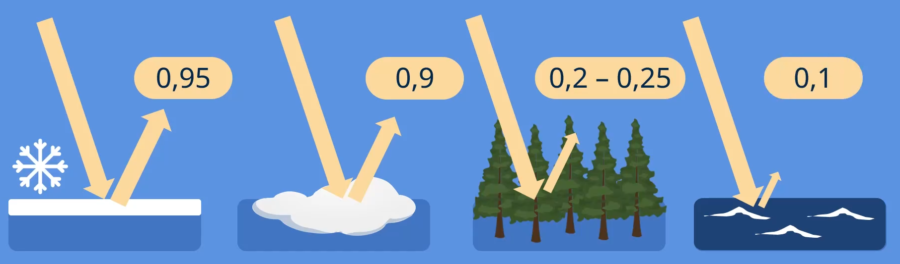
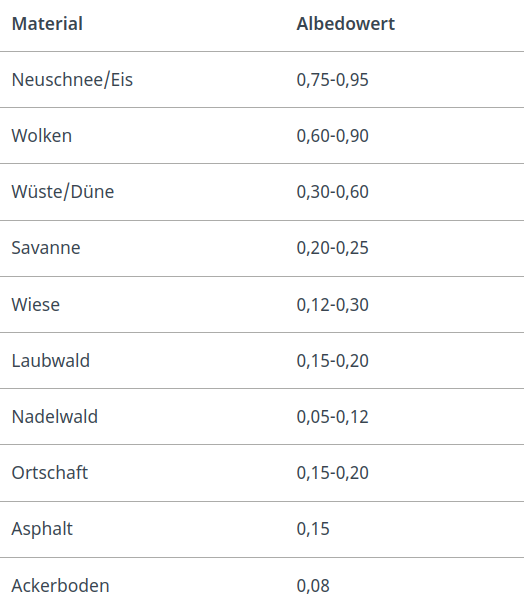
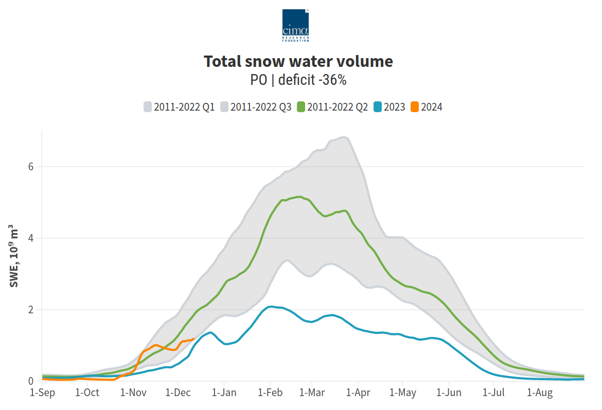
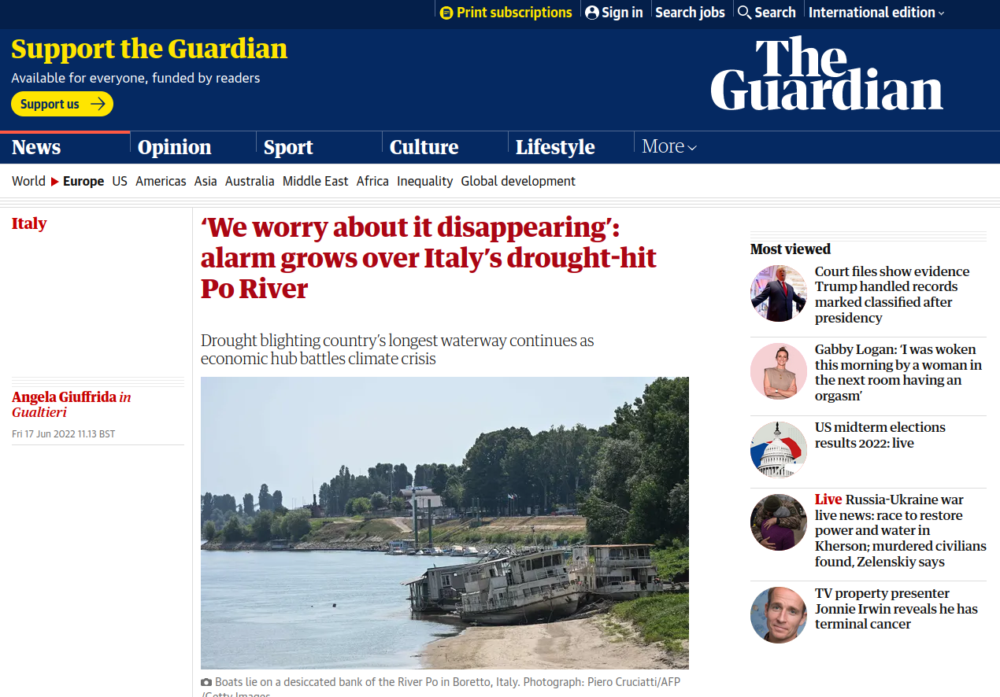
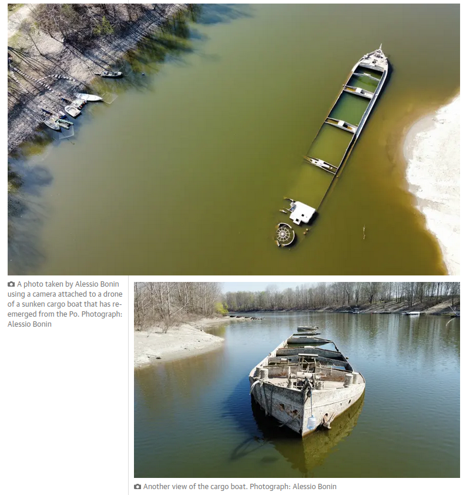
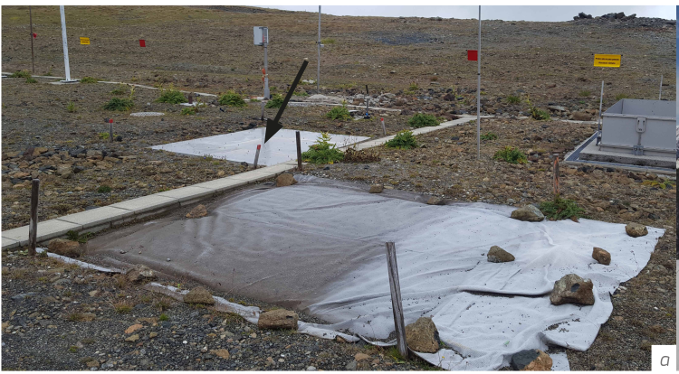
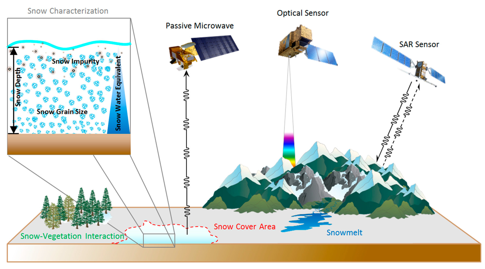
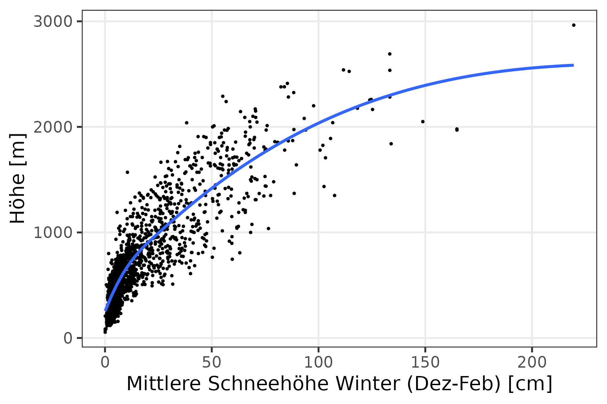

```{r setup, include=FALSE}
options(htmltools.dir.version = FALSE)
# xaringanExtra::use_panelset()
xaringanExtra::use_freezeframe()
# xaringanExtra::use_webcam()
```

## Outline

1. Was ist Schnee?
2. Schneeklima
3. Vergangenheit
4. Zukunft


---

class: center, middle, inverse

# Was ist Schnee? (für dich)?


---
background-image: url("fig/snow-fun.gif")
background-size: cover


---
background-image: url("fig/snow-shoveling.jpg")
background-size: cover


.footnote[Image by <a href="https://pixabay.com/users/alehandra13-1817807/?utm_source=link-attribution&amp;utm_medium=referral&amp;utm_campaign=image&amp;utm_content=3146420">Alehandra13</a> from <a href="https://pixabay.com//?utm_source=link-attribution&amp;utm_medium=referral&amp;utm_campaign=image&amp;utm_content=3146420">Pixabay</a>]


---

.my-h1[Andere Meinungen]


> "Quando ero giovane, pura gioia. Adesso solo scocciatura."

--

> "I don't know what snow is."

--

> "Stupore, allegria. In macchina paura. Bello in montagna."


---
background-image: url("fig/snowfall2.jpg")
background-size: cover


.footnote[Photo <a href="https://pixabay.com/users/cocoparisienne-127419/?utm_source=link-attribution&amp;utm_medium=referral&amp;utm_campaign=image&amp;utm_content=1861704">Anja</a> from <a href="https://pixabay.com//?utm_source=link-attribution&amp;utm_medium=referral&amp;utm_campaign=image&amp;utm_content=1861704">Pixabay</a>]


---


class: center, inverse, middle


# Schnee = Wasser (Teil 1: Am Anfang)


---

background-image: url("fig/snow-grains.png")
background-size: contain

.footnote[https://cryosphericsciences.org/publications/snow-classification/]

---

background-image: url("fig/snow-layer-wind.jpg")
background-size: cover

.footnote[Image by <a href="https://pixabay.com/users/natalia_kollegova-5226803/?utm_source=link-attribution&amp;utm_medium=referral&amp;utm_campaign=image&amp;utm_content=3173001">Наталья Коллегова</a> from <a href="https://pixabay.com//?utm_source=link-attribution&amp;utm_medium=referral&amp;utm_campaign=image&amp;utm_content=3173001">Pixabay</a>]

---


class: center, middle, inverse

# Warum ist Schnee wichtig?


---

background-image: url("fig/albedo-explanation.png")
background-size: cover


.footnote[Source: [studyflix.de](https://studyflix.de/erdkunde/albedo-5698/)]


---

# Albedo


.pull-left[




.footnote[Source: [studyflix.de](https://studyflix.de/erdkunde/albedo-5698/)]

]


.pull-right[



]


---

# Schneebedeckung Nordhalbkugel

.pull-left[

.footnote[Source: [Global Snow Lab](http://climate.rutgers.edu/snowcover/index.php)]
]


---

# Schneebedeckung Nordhalbkugel

.pull-left[

.footnote[Source: [Global Snow Lab](http://climate.rutgers.edu/snowcover/index.php)]
]
.pull-right[
Januar im Mittel 47 Mill. km² ~ 
- 150 Italiens
- 130 Deutschlands
- 6350 Südtirols
- 1/3 Nordhalbkugel (Landfläche)
]


---

class: center, inverse, middle


# Schnee = Wasser (Teil 2: Am Ende)


---


# Schnee als natürlicher Wasserspeicher


.pull-left[
Foto Schnee Gebirge

]

.pull-right[
Foto Staudamm

]


---
background-image: url("fig/cima-snow-2024.png")
background-size: contain


# Schneewasseräquivalent <br> Italien 2023/24

<!--  -->

.footnote[Source: https://www.cimafoundation.org/news/neve-deficit-del-44-nel-nostro-primo-aggiornamento-della-stagione/]


---

# 2022 Dürre Poebene

.leftcol-21[
<a href="https://www.theguardian.com/world/2022/jun/17/italy-drought-po-river-climate-crisis"></a>
]

.rightcol-21[
<a href="https://www.theguardian.com/world/2022/jun/17/italy-drought-po-river-climate-crisis"></a>
]


.footnote[Source: https://www.theguardian.com/world/2022/jun/17/italy-drought-po-river-climate-crisis]


---


class: center, middle, inverse

# Wie wird Schnee gemessen?

**(Fokus hier: makroskopisch)**


---
background-image: url("fig/snow-measurement1.png")
background-size: cover

.footnote[Source: [European Snow Booklet](https://doi.org/10.16904/envidat.59)]

---
background-image: url("fig/snow-measurement2.png")
background-size: contain

.footnote[Source: [European Snow Booklet](https://doi.org/10.16904/envidat.59)]

---

.pull-left[]

.pull-right[


.footnote[Source: [European Snow Booklet](https://doi.org/10.16904/envidat.59)]
]

---

# Aus der Ferne


.center[]

.footnote[Source: [Hu et al., 2017](https://doi.org/10.3390/rs9101067)]


---

class: center, middle, inverse

# (Schnee-) Klima in den Alpen

--

> "Klima ist das, was wir erwarten. <br/> Wetter ist das, was wir bekommen."


---

# berge interagieren mit luftmassen

video?


---

# Datenquelle: Alpenweite in-situ Beobachtungen

.center[]


---

background-image: url("fig/clim-hs-DJF.png")
background-size: contain


---

background-image: url("fig/clim-tmean-DJF.png")
background-size: contain


---

background-image: url("fig/clim-prec-DJF.png")
background-size: contain


---


# höhe

.center[]

winter: schneehöhe, temperatur, niederschlag


---

# nach der höhe

clustering: left stations, right bag

winter: schneehöhe, temperatur, niederschlag

N-S?


---


# veränderungen letzte 50 jahre


plot djf/mam trend by elev (abs or rel?)

percentages +/-


---

class: center, middle, inverse

# Und die Zukunft?

---

# Treibhauseffekt

.footnote[Source: , [Wikipedia: Treibhauseffekt](https://de.wikipedia.org/wiki/Treibhauseffekt), [climatechangetracker.org](https://climatechangetracker.org/global-warming)]

Treibhausgase in der Atmosphäre ~ globale Mitteltemperatur

--

ohne Treibhausgase: $-18°C$

--

vorindustriellen Zeiten (1850-1900): $-13.9°C$

--

aktuell (2023): $+15.2°C$

--

Zukunft: ~  Treibhausgase in der Atmosphäre


---


# Global vs. lokal

flexdashboard::valueBox(articles, icon = "fa-pencil")


---

# Klimamodelle

<span class="value-output" data-icon="fa-tag" data-color-accent="primary">200</span>


---


# Szenario


wenn-dann

---


# Europa


---


# 


---


# Zitate

> "Die Schneemengen haben in alpinen
Lagen oberhalb von etwa 900 Meter Höhe in den
vergangenen 100 Jahren auch nicht abgenommen."

> "Über die vergangenen 45 Jahre ist ab mittleren Höhenlagen der Alpen kein Trend zu wärmeren Wintern
messbar... Wer sich jetzt fragt, wo denn die Klimaerwärmung in den Alpen geblieben ist oder warum
denn nun die Gletscher schrumpfen, dem sei
gesagt: Die Sommer sind es!"


---


> "... die Wintersaison hat konstante Werte in den Schneefällen, konstante Werte in
der Temperatur."

> "Meine Generation und die nächsten beiden Generationen werden bestimmt keine
Probleme mit dem Klimawandel haben."

---


> "Il riscaldamento globale … dipende dalle variazioni dell’asse terrestre nel suo movimento rispetto al sole."

> "Siamo la coda di una mini glaciazione che avvenuta tra il 1500 e il 1700."

> "Quando la politica domina la scienza è solo per interessi economici."


---


> Es ist keinesfalls so, dass die Wissenschaft versucht, die Meinungsfreiheit einzudämmen. Das Recht auf freie Meinungsäußerung besitzt jeder und das ist zentral für unsere Demokratie. **Wenn jemand wirklich glaubt, dass die Erde eine Scheibe ist, soll derjenige seine Meinung behalten.** Jeder hat das Recht, sich auf die Straße zu stellen und sich zu blamieren. **Nur hat keiner das Recht darauf, damit ernst genommen zu werden.**


.footnote[Florian Aigner, [Barfuss-Interview](https://www.barfuss.it/stories/das-ist-geistiges-fast-food/), "Das ist geistiges Fast Food"]


---

# Acknowledgements

EU, PAT-APPA, Eurac, unitn

names of people

## organisations of 

CAST, POW, globoalpin, S4F ST, 


---

class: center, middle, inverse

# ? -> ! -> ???

<br><br><br><br>

Kontakt: [michael.matiu@unitn.it](michael.matiu@unitn.it)  
Homepage: [mitmat.eu](https://mitmat.eu)  
Folien: [https://mitmat.github.io/slides/](https://mitmat.github.io/slides/)  ?QR code slide link

Mehr: [Eurac Schnee Dossier](https://www.eurac.edu/de/dossiers/dossier-schnee-suedtirol-alpen), [CliRSnow Projekt](https://clirsnow.netlify.app)


